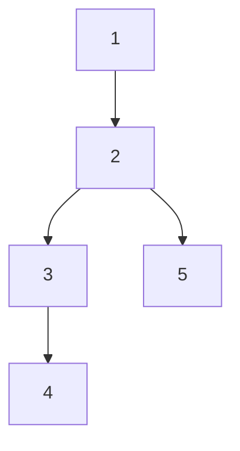
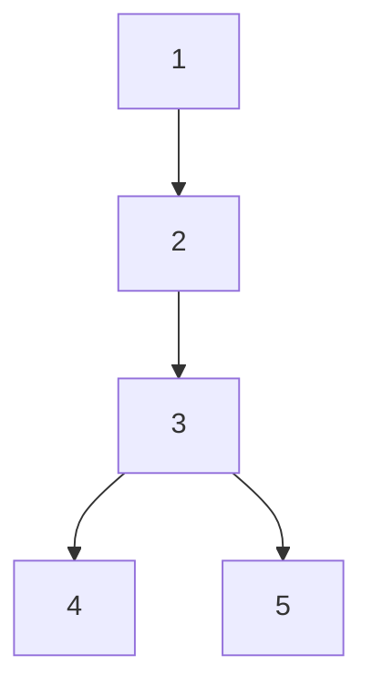

---
{"dg-publish":true,"permalink":"/02-Area/Algorithm/(Algorithm) union find/","tags":["Area/Algorithm"],"noteIcon":"","created":"2025-01-05T15:54:58.000+09:00","updated":"2025-04-07T22:51:29.895+09:00"}
---

# union find

영역 · 자원: Algorithm (../../../Algorithm%2015e9c56036e5801ea330f601d366df69.md)
고정하기: No
Status: Inbox

### 유니온 파인드(Union-Find)에 대한 간단한 설명

### 개요

유니온 파인드(Union-Find)는 **서로소 집합(Disjoint Set)**을 표현하고 관리하기 위한 자료 구조이다. 이 구조는 그래프에서 연결성을 효율적으로 관리할 때 주로 사용된다. 대표적인 사용 사례로 두 노드가 같은 집합에 속하는지 확인하거나, 두 집합을 하나로 합치는 연산이 있다.

### 주요 연산

유니온 파인드는 다음 두 가지 연산을 포함한다.

1. **Find**: 특정 노드가 속한 집합의 대표 노드를 찾는다.

2. **Union**: 두 집합을 하나로 합친다.

### 구현 방식

유니온 파인드의 주요 함수는 다음과 같다.

### 초기화 함수

```cpp
void initialize(int n) {    graph.resize(n + 1);    for (int i = 0; i <= n; i++) {        graph[i] = i;    }}
```

- `initialize`: 각 노드를 자기 자신을 부모로 가지는 독립된 집합으로 초기화한다.

### Find 함수

```cpp
int find(int n) {    if (graph[n] != n) {        graph[n] = find(graph[n]);    }    return graph[n];}
```

- `find`: 재귀적으로 부모 노드를 탐색하여 집합의 대표 노드를 반환한다.
    - 경로 압축(Path Compression)을 사용하여 탐색 경로를 최적화한다.

### Union 함수

```cpp
void union_node(int n, int m) {    int rootA = find(n);    int rootB = find(m);    if (rootA <= rootB) {        graph[rootB] = graph[rootA];    } else {        graph[rootA] = graph[rootB];    }}
```

- `union_node`: 두 노드가 속한 집합을 하나로 합친다.
    - 두 집합의 대표 노드를 기준으로 부모 노드를 갱신한다.
    - 작은 값을 부모로 설정하는 규칙을 사용한다.

### 부모 노드 파악 방식 예시

다음은 머메이드 다이어그램을 활용하여 두 노드가 합쳐지는 과정을 보여준다.



위에서 `union_node(4, 5)`를 수행하면, 다음과 같이 변환된다.



### 함수 설명 요약

- **initialize**: 유니온 파인드 자료 구조를 초기화한다. 각 노드는 자기 자신을 부모로 가진다.
- **find**: 노드의 집합을 식별하기 위해 대표 노드를 반환하며, 경로 압축을 통해 효율성을 높인다.
- **union_node**: 두 집합을 합치면서 부모 노드를 갱신한다.

### 관련 토픽

- 서로소 집합
- 경로 압축(Path Compression)
- 최소 스패닝 트리
- 크루스칼 알고리즘