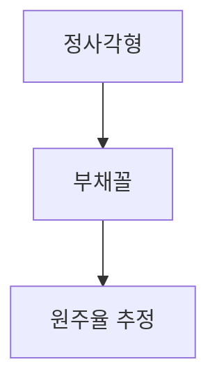

---
{"dg-publish":true,"permalink":"/02-Area/Algorithm/(Algorithm) 기본 알고리즘/","tags":["Area/Algorithm"],"noteIcon":"","created":"2025-01-05T15:54:58.000+09:00","updated":"2025-04-07T22:51:45.513+09:00"}
---

# 기본 알고리즘

알고리즘은 문제를 해결하는 구체적인 절차 또는 방법을 의미하며, 수학적 이론을 바탕으로 다양한 문제를 효율적으로 해결할 수 있다. 아래에서는 **소수 판정**, **유클리드 호제법**, **경우의 수**, **확률과 기댓값**, **몬테카를로법**과 관련된 기본 알고리즘을 설명한다.

## 소수 판정

소수는 1과 자기 자신만을 약수로 가지는 수이다. **소수 판정**은 주어진 수가 소수인지 판단하는 알고리즘으로, 수많은 코딩 테스트에서 단골로 등장한다.

### 일반적인 방법

주어진 수 `n`을 소수인지 확인하는 가장 기본적인 방법은 **2부터 n-1까지의 수로 나누어 보는 방식**이다. 만약 나머지가 0인 수가 있으면 소수가 아니고, 없으면 소수이다. 이 방법은 매우 비효율적이다.

### 효율적인 방법: 제곱근(sqrt) 알고리즘

소수 판정을 **더 효율적으로** 할 수 있는 방법은 **2부터 sqrt(n)까지의 수**로만 나누어보는 것이다. 이는 **귀류법**을 통해 증명할 수 있다.

- **귀류법 증명**: `n`이 소수인지 확인하기 위해서는 sqrt(n)보다 작은 수들로 나누는 것만으로 충분하다. 만약 `n`이 sqrt(n)보다 큰 약수를 가진다면, 이때 나머지 하나의 약수는 sqrt(n)보다 작을 수밖에 없기 때문이다. 따라서, sqrt(n)까지만 나누어보면 모든 경우를 확인할 수 있다.

```cpp
bool is_prime(int n) {    if (n <= 1) return false;    for (int i = 2; i <= sqrt(n); i++) {        if (n % i == 0) return false;    }    return true;}
```

### 응용: 약수 구하기

소수 판정 알고리즘을 확장하면, **약수를 구하는 알고리즘**도 구현할 수 있다. 2부터 sqrt(n)까지 나눈다면, 그 몫 역시 약수임을 알 수 있다.

```cpp
void find_divisors(int n) {    for (int i = 1; i <= sqrt(n); i++) {        if (n % i == 0) {            cout << i << " ";            if (i != n / i) cout << n / i << " ";        }    }    cout << endl;}
```

### 응용: 소인수분해

소인수분해는 **2부터 sqrt(n)**까지 나누고, 나누어떨어지는 수로 계속 나누어가는 방법이다. 이 과정에서 중복된 소수는 반복해서 나누며, 더 이상 나누어지지 않을 때까지 진행한다.

```cpp
void prime_factors(int n) {    for (int i=2 ; i * i <= n ; i++) {        while (n % i == 0) {            cout << i << " ";            n /= i;        }    }    if (n >= 2) cout << n;}
```

## 유클리드 호제법

**유클리드 호제법**은 두 수의 **최대공약수(GCD)**를 구하는 방법이다. 다음과 같은 절차를 따른다:

1. 두 수 A, B에서 **A > B**라 가정하자.
2. A를 B로 나눈 **나머지**를 구하고, 이를 A에 할당한다.
3. B를 A에 할당하고, 다시 나누는 과정을 반복한다.
4. 나머지가 0이 되는 순간의 **B 값**이 최대공약수이다.

이 과정은 직사각형을 작은 정사각형 타일로 메우는 과정에 비유할 수 있다. 직사각형을 점점 작은 정사각형으로 나누어가는 과정에서 **최대공약수**가 남는다.

```cpp
int gcd(int a, int b) { // a > b    while (b != 0) {        int r = a % b;        a = b;        b = r;    }    return a;}
```

## 경우의 수: 순열과 조합

**순열 (Permutation)**과 **조합 (Combination)**은 경우의 수를 계산하는 중요한 수학적 개념이다.

1. **순열**: 주어진 n개의 항목 중에서 순서 있게 r개를 선택하는 방법.
    - 공식: `P(n, r) = n! / (n - r)!`
2. **조합**: 주어진 n개의 항목 중에서 순서 없이 r개를 선택하는 방법.
    - 공식: `C(n, r) = n! / (r! * (n - r)!)`

## 확률과 기댓값

**확률**은 어떤 사건이 발생할 **가능성**을 나타낸다. 사건 A의 확률은 다음과 같이 정의된다:

- **P(A) = (결과가 나오는 경우의 수) / (전체 경우의 수)**

**기댓값**은 확률을 기반으로, 어떤 사건이 일어날 때 **기대되는 평균 값**을 의미한다.

- **기댓값** `E(X)` = `P1 * X1 + P2 * X2 + ... + Pn * Xn`
    - `P1`, `P2`는 각 사건이 일어날 확률, `X1`, `X2`는 사건이 일어났을 때의 결과 값이다.

기댓값의 중요한 성질 중 하나는 **선형성**이다. 서로 독립된 두 사건의 기댓값을 더하면 전체 기댓값이 된다.

예시:

- 주사위 던지기: 기댓값은 `(1/6) * (1 + 2 + 3 + 4 + 5 + 6) = 3.5`
- 동전 던지기: 앞면이 1, 뒷면이 0이라면 기댓값은 `(1/2) * (1 + 0) = 0.5`

## 몬테카를로법

**몬테카를로법**은 확률과 통계적인 방법을 사용해 **해결하기 어려운 문제를 근사적으로 해결**하는 기법이다. 이 방법은 컴퓨터 시뮬레이션을 통해 수많은 난수나 반복 실험을 수행하여 확률적 해를 구하는 방식이다.

**예시**: 동전을 매우 많이 던져서 앞면이 나올 확률을 구하거나, **정사각형 내부에 부채꼴을 그린 뒤 무작위로 점을 찍어 원주율을 추정**하는 방법이 있다.



### 평균, 표준편차, 정규분포

1. **평균**: 데이터의 중심 값을 나타낸다.
    - 공식: `평균 = (전체 데이터의 합) / (데이터 개수)`
2. **표준편차**: 데이터가 평균에서 얼마나 떨어져 있는지를 나타내는 값.
    - 공식: `표준편차 = sqrt(Σ(x - 평균)^2 / N)`
3. **정규분포**: 데이터가 **평균을 중심으로 종 모양으로 분포**하는 패턴이다. 정규분포는 자연계에서 많이 나타나며, 평균을 기준으로 좌우대칭이다.
4. **68-95-99.7의 법칙**: 정규분포에서 평균을 중심으로 ±1, 2, 3 표준편차 안에 전체 데이터의 68%, 95%, 99.7%가 포함된다.

## 정렬과 재귀

### 정렬: 기본 개념

**정렬**은 데이터를 특정한 기준에 따라 순서대로 배열하는 작업이다. C++과 Python 같은 고수준 언어에서는 `sort()` 함수를 사용해 간편하게 정렬할 수 있지만, 정렬 알고리즘을 직접 구현하는 것도 중요하다.

### 선택 정렬 (Selection Sort)

**선택 정렬**은 배열에서 가장 작은(혹은 큰) 원소를 찾아 그 원소를 배열의 맨 앞에 두고, 나머지 부분을 계속 정렬해 나가는 방식이다. 각 단계에서 가장 작은 원소를 찾아 첫 번째 요소와 교환하는 작업을 반복한다. 선택 정렬의 시간 복잡도는 **O(N^2)**로, 효율적이지 않기 때문에 큰 데이터에서는 잘 사용되지 않는다.

**C++ 선택 정렬 예시**:

```cpp
#include <iostream>#include <vector>using namespace std;void selection_sort(vector<int>& arr) {    int n = arr.size();    for (int i = 0; i < n - 1; i++) {        int min_idx = i;        for (int j = i + 1; j < n; j++) {            if (arr[j] < arr[min_idx]) {                min_idx = j;            }        }        swap(arr[i], arr[min_idx]);  // 최소값과 현재 값을 교환    }}int main() {    vector<int> arr = {64, 25, 12, 22, 11};    selection_sort(arr);    cout << "정렬된 배열: ";    for (int i = 0; i < arr.size(); i++) {        cout << arr[i] << " ";    }    cout << endl;    return 0;}
```

**선택 정렬**은 구현이 간단하지만, 시간 복잡도가 높기 때문에 대규모 데이터를 다룰 때는 적합하지 않다.

### 재귀: 기본 개념

**재귀(Recursion)**는 **자기 자신을 호출하는 함수**를 말한다. 재귀를 활용하면 반복적인 문제를 간결하게 해결할 수 있으며, 알고리즘의 구현이 간단해진다. 재귀 함수는 일반적으로 **기저(base) 조건**과 **재귀 호출**로 구성된다.

### 재귀 예시: 팩토리얼 계산

팩토리얼 `n!`는 `n * (n-1)!`로 정의되며, **기저 조건**으로 `n = 1일 때 1`로 정의할 수 있다. 이를 재귀적으로 구현하면 다음과 같다.

**C++ 팩토리얼 계산 예시**:

```cpp
#include <iostream>using namespace std;int factorial(int n) {    if (n == 1) return 1;  // base case: n이 1일 때    return n * factorial(n - 1);  // recursive step: n * (n-1)!}int main() {    int n;    cout << "팩토리얼을 계산할 수를 입력하세요: ";    cin >> n;    cout << n << "! = " << factorial(n) << endl;    return 0;}
```

이를 이용한 다양한 정렬 방법은 폴더에 따로 정리해놓았다.

## 동적 계획법 (Dynamic Programming)

**동적 계획법(DP)**은 **점화식**을 이용해 문제를 해결하는 방식이다. **이전 값을 저장**하여 동일한 연산을 반복하지 않고, 더 빠르게 결과를 얻는다. 동적 계획법의 대표적인 예로 **피보나치 수열**이 있다. 일반적으로 피보나치 수열을 재귀적으로 계산하면 **지수 시간 복잡도(O(2^N))**를 가진다. 하지만, 동적 계획법을 이용하면 **O(N)**으로 최적화할 수 있다.

### 피보나치 수열: 동적 계획법 예시

피보나치 수열은 다음과 같은 점화식을 가진다:

- **F(n) = F(n-1) + F(n-2)**
- **F(1) = 1, F(2) = 1**

동적 계획법을 이용하면 이전에 계산한 값을 저장해 불필요한 중복 계산을 피할 수 있다.

**C++ 피보나치 동적 계획법 예시**:

```cpp
#include <iostream>#include <vector>using namespace std;int fibonacci(int n) {    vector<int> dp(n + 1);    dp[1] = 1;    dp[2] = 1;    for (int i = 3; i <= n; i++) {        dp[i] = dp[i - 1] + dp[i - 2];    }    return dp[n];}int main() {    int n;    cout << "피보나치 수열의 n번째 항을 입력하세요: ";    cin >> n;    cout << "F(" << n << ") = " << fibonacci(n) << endl;    return 0;}
```

### 동적 계획법의 응용

**냅색 문제**나 **부분합 문제**는 동적 계획법을 사용하는 대표적인 예시이다. 이 문제들은 주어진 범위 내에서 최적의 결과를 도출하는 문제로, 큰 문제를 작은 문제로 분할하고 이를 바탕으로 전체 문제를 해결한다.