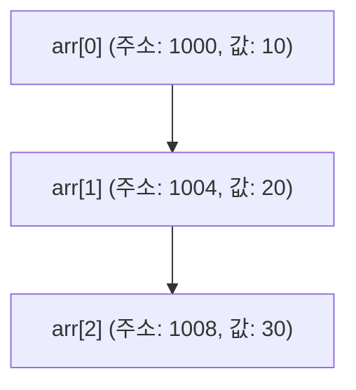

---
{"dg-publish":true,"permalink":"/02-Area/Algorithm/(Algorithm) 배열/","tags":["Area/Algorithm"],"noteIcon":"","created":"2025-01-05T15:54:58.000+09:00","updated":"2025-04-07T22:51:55.721+09:00"}
---

# 배열

**배열**은 같은 타입의 요소들을 메모리 상에 **일렬로 배열**하는 데이터 구조이다. 배열은 여러 개의 데이터를 **연속된 메모리 공간**에 저장하며, **인덱스(index)**를 사용해 각 요소에 접근할 수 있다. 인덱스는 0부터 시작하며, 배열 요소의 순서에 따라 인덱스를 지정한다.

```c
int arr[5];  // 정수형 배열 선언, 5개의 정수 요소를 저장할 수 있음
```

## 배열의 메모리 구조

배열은 **배열명**이 곧 배열의 시작 주소를 나타낸다. 즉, 배열의 첫 번째 요소의 메모리 주소를 가리키며, 이를 통해 배열의 나머지 요소들에 접근할 수 있다. 배열의 각 요소는 **데이터 타입**에 따라 메모리 상에서 일정한 간격을 두고 저장된다.

```c
int arr[3] = {10, 20, 30};
```

이 예시에서 `arr`는 배열의 시작 주소를 나타내며, 각 정수는 4바이트씩 차지하게 된다. 이를 도식화하면 다음과 같다:



- **arr**: 배열의 시작 주소
- **int**: 4바이트 크기를 차지하는 데이터 타입이므로 각 요소는 4바이트 간격으로 저장된다.

## 배열의 정의 및 초기화

배열은 정의할 때 **크기**를 명시하며, 초기화는 선언과 동시에 값을 할당하는 방식으로 이루어진다. 배열은 값을 할당하지 않으면 **쓰레기 값**(garbage value)을 가질 수 있다.

```c
int numbers[5] = {1, 2, 3, 4, 5};  // 크기가 5인 배열을 선언하고 초기화
```

또한 배열 크기를 지정하지 않고도 배열을 초기화할 수 있다.

```c
int numbers[] = {1, 2, 3};  // 크기는 초기화된 값의 개수로 결정됨
```

## ? 배열과 언어별 차이

배열의 처리 방식은 **프로그래밍 언어**마다 다르다.

- **C/C++**: 배열은 고정 크기를 가지며, 메모리 주소를 직접 다루는 방식이다. 배열 이름은 첫 번째 요소의 주소를 가리킨다.
- **Java**: 배열은 동적으로 크기가 결정되며, **배열 객체**로 처리된다. 배열의 크기는 한 번 정해지면 변경할 수 없으나, 배열 자체는 객체로 다뤄진다.
- **C#**: 배열은 `System.Array` 객체로 처리되며, 다양한 메서드를 제공한다. 크기는 고정되지만 다양한 배열 관련 기능을 제공하는 라이브러리가 있다.

### UTF-8 배열의 한계

**UTF-8** 문자열은 **가변 길이 인코딩** 방식을 사용하므로, **고정된 크기**로 배열을 만들기 어렵다. UTF-8에서는 문자마다 바이트 수가 다를 수 있기 때문에 배열 요소로 사용하기에는 부적절하다. 배열은 **고정된 크기**와 **동일한 타입**의 데이터를 저장하는 구조이기 때문에, 가변 길이 문자를 지원하지 못한다.

## 다차원 배열

**다차원 배열**은 **2차원 배열** 또는 그 이상의 배열을 의미하며, 각 차원은 배열로 구성된다. C에서는 `[][]`를 사용하여 다차원 배열을 생성할 수 있다.

```c
int matrix[3][3] = {    {1, 2, 3},    {4, 5, 6},    {7, 8, 9}};
```

이 배열은 3x3의 행렬 형태로 데이터를 저장한다. 다차원 배열은 **행렬 연산**이나 **이미지 처리** 등의 작업에서 자주 사용된다.

## 배열을 함수의 인자로 사용

배열 이름을 함수에 인자로 전달할 때 배열의 **주소**가 전달되며, 이는 **call by address** 방식으로 처리된다. 즉, 함수 내에서 배열의 요소를 수정하면 원래 배열의 값도 변경된다.

```c
void modifyArray(int arr[], int size) {    for (int i = 0; i < size; i++) {        arr[i] *= 2;  // 배열의 값을 두 배로    }}int main() {    int myArray[3] = {1, 2, 3};    modifyArray(myArray, 3);  // 배열을 함수에 전달 (주소가 전달됨)}
```

## 배열의 크기 계산

배열의 요소 개수는 `sizeof()` 연산자를 이용해 직접 계산할 수 있다. 배열의 전체 크기를 배열의 첫 번째 요소의 크기로 나누면 배열의 총 요소 수를 구할 수 있다.

```c
int arr[5] = {1, 2, 3, 4, 5};int size = sizeof(arr) / sizeof(arr[0]);  // 배열의 크기 계산printf("배열의 요소 개수: %d\n", size);  // 출력: 5
```

# 배열 요약

배열은 C 언어에서 동일한 타입의 데이터를 연속된 메모리 공간에 저장하는 중요한 자료구조이다. 배열의 처리 방식은 언어마다 다르며, 배열은 함수 인자로도 전달할 수 있고, 다차원 배열을 통해 복잡한 데이터 구조를 표현할 수 있다. `sizeof` 함수로 배열의 크기를 계산할 수 있으며, 배열의 요소는 메모리 주소를 기반으로 접근된다.